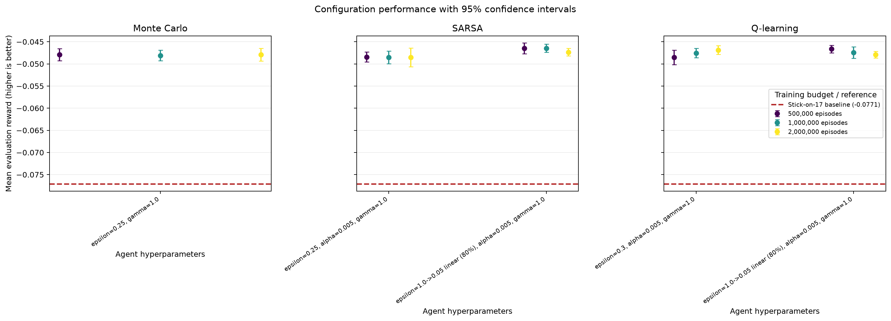
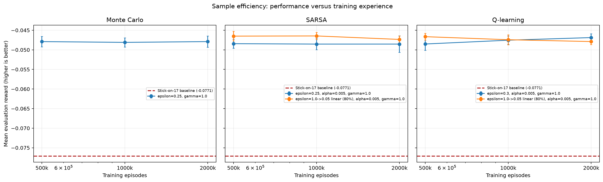
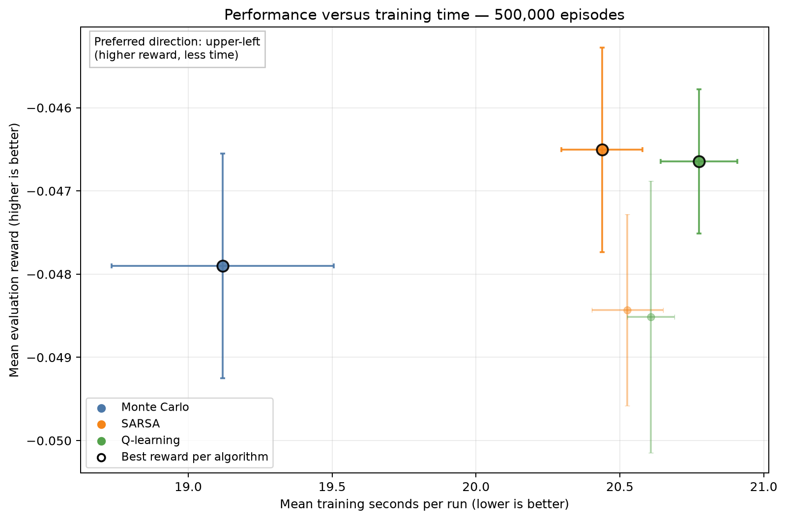
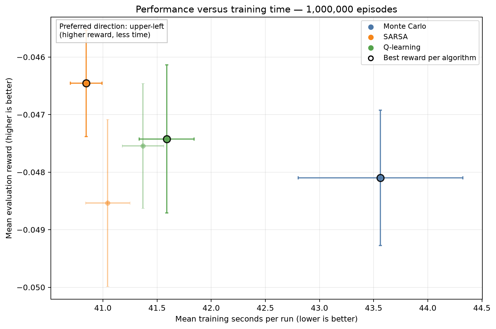
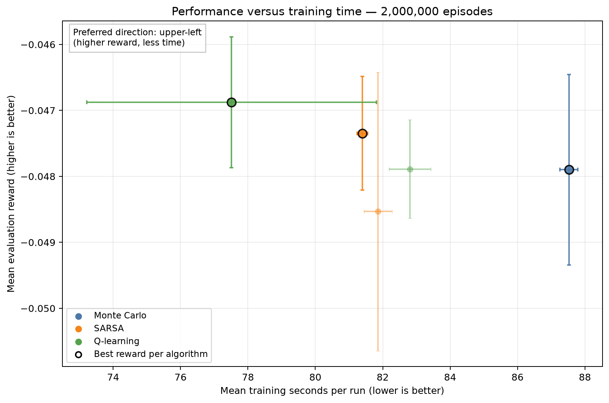
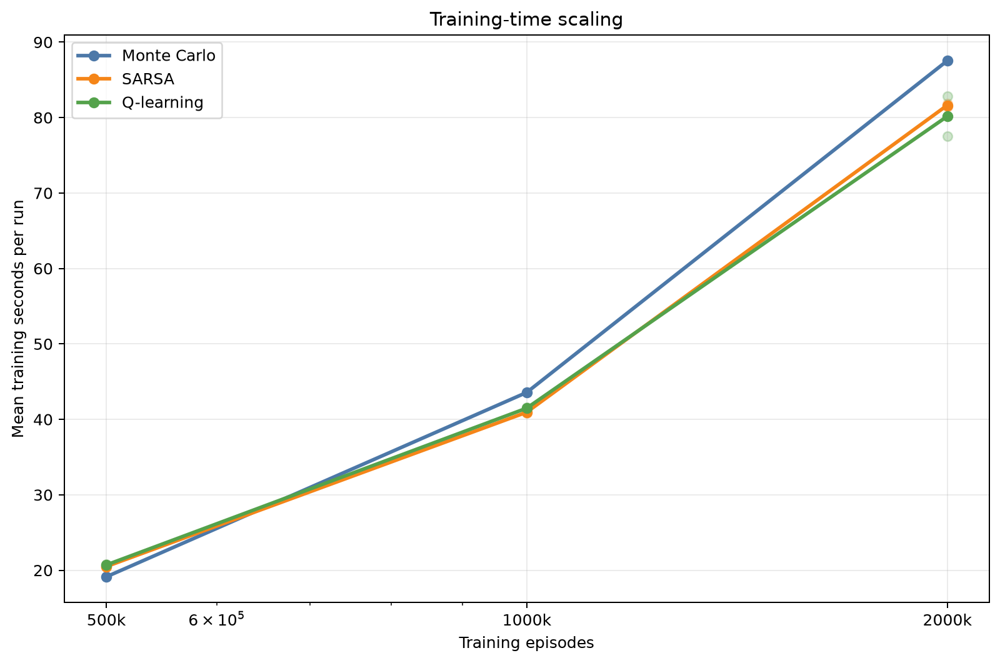

# Analysis: blackjack_selected_long_budget_comparison

Environment variant: **standard**.

## Executive summary

The highest observed final reward came from **SARSA** with `epsilon=1.0->0.05 linear (80%), alpha=0.005, gamma=1.0`. Its mean reward was **-0.04646** (approximate 95% CI -0.04738 to -0.04553), with a 43.15% win rate.

The sweep status is `completed`: 150 of 150 runs completed and 0 failed.

## Best configuration per algorithm

| Algorithm | Training episodes | Parameters | Mean reward (95% CI) | Win rate | Training time |
|---|---:|---|---:|---:|---:|
| Monte Carlo | 2,000,000 | `epsilon=0.25, gamma=1.0` | -0.04790 [-0.04934, -0.04646] | 43.36% | 87.53 s |
| Q-learning | 500,000 | `epsilon=1.0->0.05 linear (80%), alpha=0.005, gamma=1.0` | -0.04664 [-0.04751, -0.04578] | 43.10% | 20.78 s |
| SARSA | 1,000,000 | `epsilon=1.0->0.05 linear (80%), alpha=0.005, gamma=1.0` | -0.04646 [-0.04738, -0.04553] | 43.15% | 40.85 s |

## Literature baseline

The **stick-on-17** policy hits below 17 and sticks on 17 or above. On the same 100,000 seeded evaluation episodes, its mean reward was **-0.07711** with a 41.05% win rate.

Reference: Richard S. Sutton and Andrew G. Barto, *Reinforcement Learning: An Introduction*, second edition, Example 5.1: Blackjack (2018), http://incompleteideas.net/book/RLbook2020.pdf.

## Paired comparison of the selected configurations

Differences below are calculated seed by seed as the first algorithm minus the second. A positive value favors the first algorithm.

| Comparison | Seeds | Mean reward difference (95% CI) | Interpretation |
|---|---:|---:|---|
| Monte Carlo - Q-learning | 10 | -0.00125 [-0.00286, 0.00035] | difference is inconclusive at this precision |
| Monte Carlo - SARSA | 10 | -0.00144 [-0.00281, -0.00007] | interval excludes zero |
| Q-learning - SARSA | 10 | -0.00019 [-0.00148, 0.00110] | difference is inconclusive at this precision |

These normal-approximation intervals are descriptive; they are not a replacement for a pre-specified final statistical testing protocol.

## Sample efficiency

Each point is a separately trained agent at that episode budget. Higher reward with fewer episodes indicates better sample efficiency.

## Efficiency

### 500,000 training episodes

### 1,000,000 training episodes

### 2,000,000 training episodes

Each chart holds the training budget fixed. Every point is one hyperparameter configuration, horizontal intervals show uncertainty in mean training time, and vertical intervals show uncertainty in mean evaluation reward. The preferred region is the upper-left; black outlines identify the best-reward configuration for each algorithm at that budget.

Training times were collected while independent runs could execute in parallel. They are useful operational measurements, but CPU contention means they should not be treated as clean single-process algorithm benchmarks.

## Interpretation limits and next steps

- Results use 10 independent training seeds per configuration; retain the per-seed results when applying the final paired statistical test.
- The best settings were selected using the same evaluation results shown here. A separate final seed set reduces selection bias.
- Confidence-interval overlap alone does not prove algorithms are equivalent.
- Episode-budget points are trained independently from scratch; they estimate sample efficiency but are not checkpoints from one continuous run.
- Evaluate environment variants before making claims about generalisation.

## Generated artifacts

- Source summary: `results/final/blackjack_selected_long_budget_comparison_20260828T132601Z/summary.json`
- Full ranked table: `configuration_results.csv`
- Final reward chart: `configuration_performance.png`
- Sample-efficiency chart: `sample_efficiency.png`
- Training-time chart: `training_time.png`
- Performance-versus-training-time charts: one `performance_vs_training_time_<episodes>.png` file per training budget
