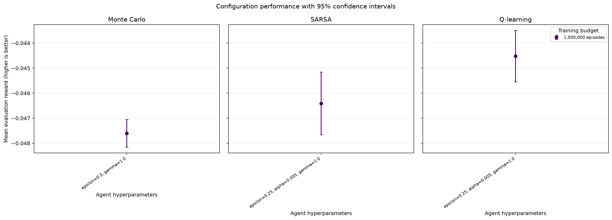
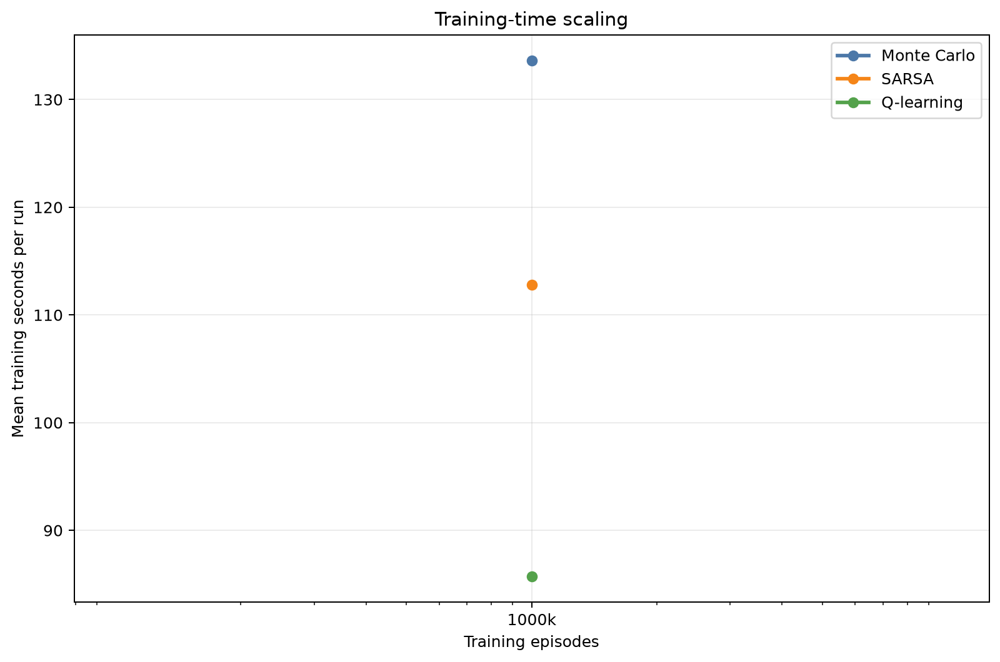

# Analysis: blackjack_selected_million_comparison

## Executive summary

The highest observed final reward came from **Q-learning** with `epsilon=0.25, alpha=0.005, gamma=1.0`. Its mean reward was **-0.04452** (approximate 95% CI -0.04554 to -0.04350), with a 43.20% win rate.

The sweep status is `completed`: 30 of 30 runs completed and 0 failed.

## Best configuration per algorithm

| Algorithm | Training episodes | Parameters | Mean reward (95% CI) | Win rate | Training time |
|---|---:|---|---:|---:|---:|
| Monte Carlo | 1,000,000 | `epsilon=0.3, gamma=1.0` | -0.04760 [-0.04816, -0.04705] | 43.35% | 133.60 s |
| Q-learning | 1,000,000 | `epsilon=0.25, alpha=0.005, gamma=1.0` | -0.04452 [-0.04554, -0.04350] | 43.20% | 85.71 s |
| SARSA | 1,000,000 | `epsilon=0.25, alpha=0.005, gamma=1.0` | -0.04641 [-0.04766, -0.04515] | 43.26% | 112.79 s |

## Paired comparison of the selected configurations

Differences below are calculated seed by seed as the first algorithm minus the second. A positive value favors the first algorithm.

| Comparison | Seeds | Mean reward difference (95% CI) | Interpretation |
|---|---:|---:|---|
| Monte Carlo - Q-learning | 10 | -0.00308 [-0.00450, -0.00167] | interval excludes zero |
| Monte Carlo - SARSA | 10 | -0.00119 [-0.00252, 0.00014] | difference is inconclusive at this precision |
| Q-learning - SARSA | 10 | 0.00189 [0.00024, 0.00354] | interval excludes zero |

These normal-approximation intervals are descriptive; they are not a replacement for a pre-specified final statistical testing protocol.

## Final configuration scope

This stage intentionally evaluates only one configuration per algorithm. Hyperparameter sensitivity should be interpreted from the pilot grid search, not re-estimated from these final runs.

## Efficiency

Training times were collected while independent runs could execute in parallel. They are useful operational measurements, but CPU contention means they should not be treated as clean single-process algorithm benchmarks.

## Interpretation limits and next steps

- Results use 10 independent training seeds per configuration; retain the per-seed results when applying the final paired statistical test.
- Hyperparameters were selected in a separate pilot sweep, reducing selection bias in this final evaluation.
- Confidence-interval overlap alone does not prove algorithms are equivalent.
- Episode-budget points are trained independently from scratch; they estimate sample efficiency but are not checkpoints from one continuous run.
- Evaluate environment variants before making claims about generalisation.

## Generated artifacts

- Source summary: `results/final/blackjack_selected_million_comparison_20260819T172824Z/summary.json`
- Full ranked table: `configuration_results.csv`
- Final reward chart: `configuration_performance.png`
- Sample-efficiency chart: `sample_efficiency.png`
- Training-time chart: `training_time.png`
