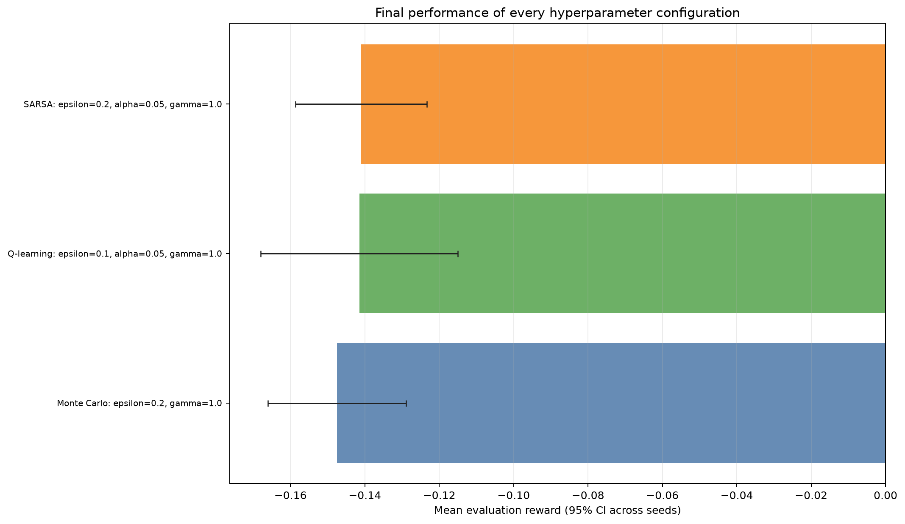
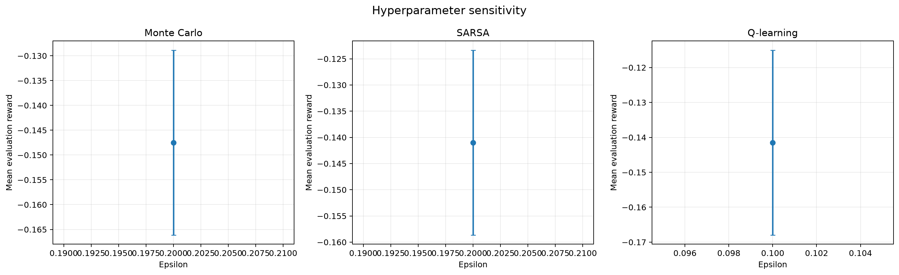
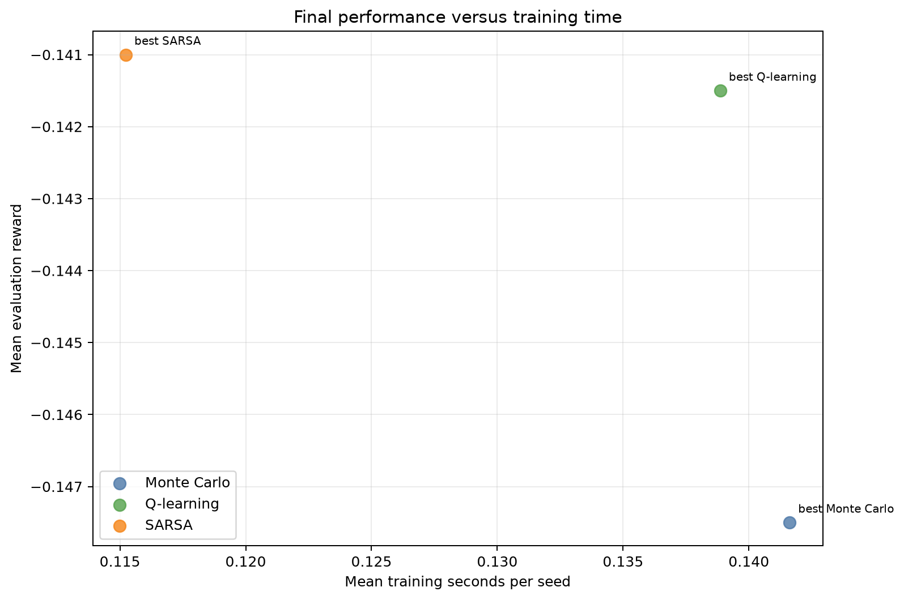

# Analysis: blackjack_final_smoke

## Executive summary

The highest observed final reward came from **SARSA** with `epsilon=0.2, alpha=0.05, gamma=1.0`. Its mean reward was **-0.14100** (approximate 95% CI -0.15864 to -0.12336), with a 39.35% win rate.

The sweep status is `completed`: 6 of 6 runs completed and 0 failed.

## Best configuration per algorithm

| Algorithm | Parameters | Mean reward (95% CI) | Win rate | Training time |
|---|---|---:|---:|---:|
| Monte Carlo | `epsilon=0.2, gamma=1.0` | -0.14750 [-0.16612, -0.12888] | 39.30% | 0.14 s |
| Q-learning | `epsilon=0.1, alpha=0.05, gamma=1.0` | -0.14150 [-0.16796, -0.11504] | 39.30% | 0.14 s |
| SARSA | `epsilon=0.2, alpha=0.05, gamma=1.0` | -0.14100 [-0.15864, -0.12336] | 39.35% | 0.12 s |

## Paired comparison of the selected configurations

Differences below are calculated seed by seed as the first algorithm minus the second. A positive value favors the first algorithm.

| Comparison | Seeds | Mean reward difference (95% CI) | Interpretation |
|---|---:|---:|---|
| Monte Carlo - Q-learning | 2 | -0.00600 [-0.01384, 0.00184] | difference is inconclusive at this precision |
| Monte Carlo - SARSA | 2 | -0.00650 [-0.04276, 0.02976] | difference is inconclusive at this precision |
| Q-learning - SARSA | 2 | -0.00050 [-0.04460, 0.04360] | difference is inconclusive at this precision |

These normal-approximation intervals are descriptive; they are not a replacement for a pre-specified final statistical testing protocol.

## Hyperparameter sensitivity

- **Monte Carlo:** the best setting was `epsilon=0.2, gamma=1.0` and the worst was `epsilon=0.2, gamma=1.0`. The observed reward spread was 0.00000.
- **Q-learning:** the best setting was `epsilon=0.1, alpha=0.05, gamma=1.0` and the worst was `epsilon=0.1, alpha=0.05, gamma=1.0`. The observed reward spread was 0.00000.
- **SARSA:** the best setting was `epsilon=0.2, alpha=0.05, gamma=1.0` and the worst was `epsilon=0.2, alpha=0.05, gamma=1.0`. The observed reward spread was 0.00000.

## Efficiency

Training times were collected while independent runs could execute in parallel. They are useful operational measurements, but CPU contention means they should not be treated as clean single-process algorithm benchmarks.

## Interpretation limits and next steps

- This experiment uses only 2 training seeds per configuration. Use at least 10-20 fresh seeds for a stronger final comparison.
- Hyperparameters were selected in a separate pilot sweep, reducing selection bias in this final evaluation.
- Confidence-interval overlap alone does not prove algorithms are equivalent.
- This summary records only final performance. Add training checkpoints to compare learning speed and sample efficiency directly.
- Evaluate environment variants before making claims about generalisation.

## Generated artifacts

- Source summary: `results/smoke/blackjack_final_smoke_20260816T183451Z/summary.json`
- Full ranked table: `configuration_results.csv`
- Final reward chart: `configuration_performance.png`
- Sensitivity chart: `hyperparameter_sensitivity.png`
- Efficiency chart: `reward_vs_training_time.png`
