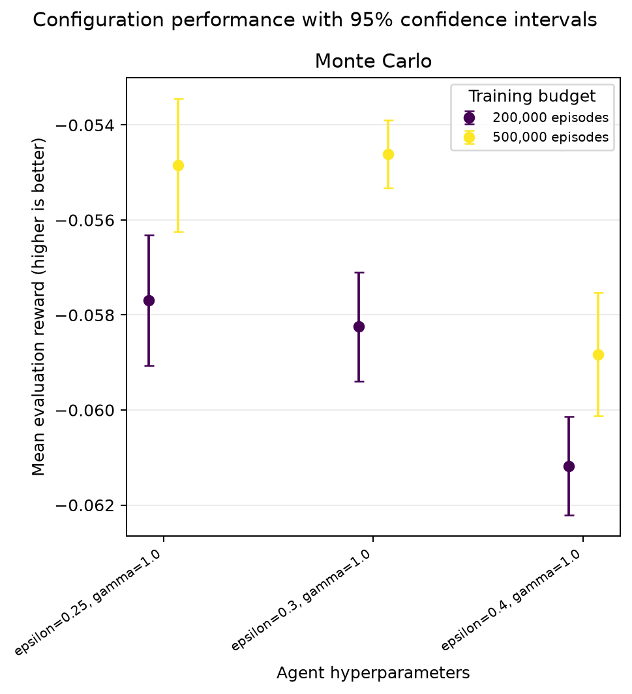
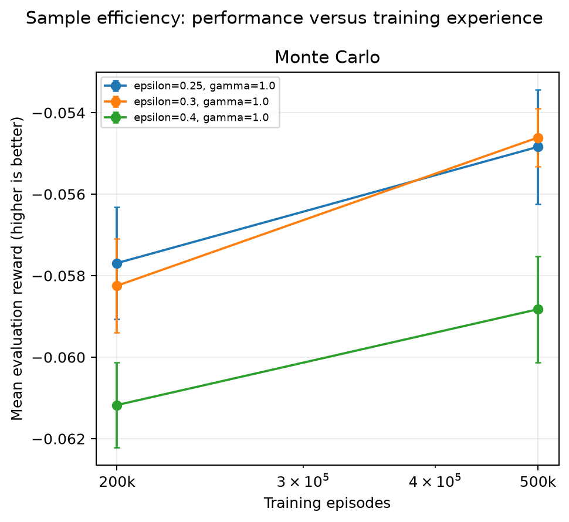
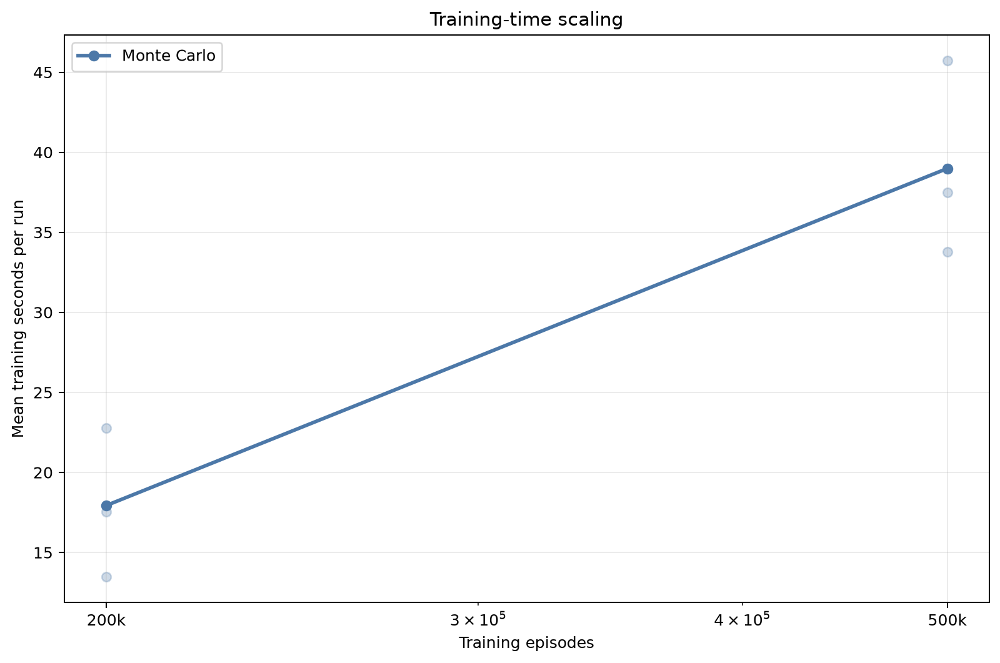

# Analysis: blackjack_monte_carlo_epsilon_extension

## Executive summary

The highest observed final reward came from **Monte Carlo** with `epsilon=0.3, gamma=1.0`. Its mean reward was **-0.05461** (approximate 95% CI -0.05533 to -0.05390), with a 43.03% win rate.

The sweep status is `completed`: 60 of 60 runs completed and 0 failed.

## Best configuration per algorithm

| Algorithm | Training episodes | Parameters | Mean reward (95% CI) | Win rate | Training time |
|---|---:|---|---:|---:|---:|
| Monte Carlo | 500,000 | `epsilon=0.3, gamma=1.0` | -0.05461 [-0.05533, -0.05390] | 43.03% | 33.76 s |

## Paired comparison of the selected configurations

Differences below are calculated seed by seed as the first algorithm minus the second. A positive value favors the first algorithm.

| Comparison | Seeds | Mean reward difference (95% CI) | Interpretation |
|---|---:|---:|---|

These normal-approximation intervals are descriptive; they are not a replacement for a pre-specified final statistical testing protocol.

## Sample efficiency

Each point is a separately trained agent at that episode budget. Higher reward with fewer episodes indicates better sample efficiency.

## Efficiency

Training times were collected while independent runs could execute in parallel. They are useful operational measurements, but CPU contention means they should not be treated as clean single-process algorithm benchmarks.

## Interpretation limits and next steps

- Results use 10 independent training seeds per configuration; retain the per-seed results when applying the final paired statistical test.
- The best settings were selected using the same evaluation results shown here. A separate final seed set reduces selection bias.
- Confidence-interval overlap alone does not prove algorithms are equivalent.
- Episode-budget points are trained independently from scratch; they estimate sample efficiency but are not checkpoints from one continuous run.
- Evaluate environment variants before making claims about generalisation.

## Generated artifacts

- Source summary: `results/sweeps/blackjack_monte_carlo_epsilon_extension_20260819T170208Z/summary.json`
- Full ranked table: `configuration_results.csv`
- Final reward chart: `configuration_performance.png`
- Sample-efficiency chart: `sample_efficiency.png`
- Training-time chart: `training_time.png`
