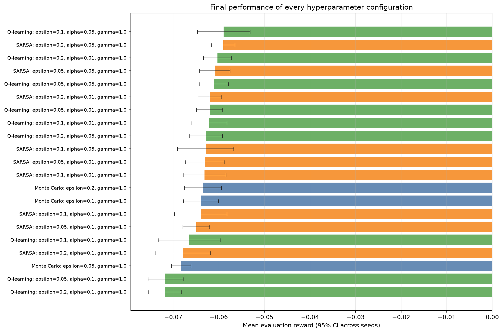
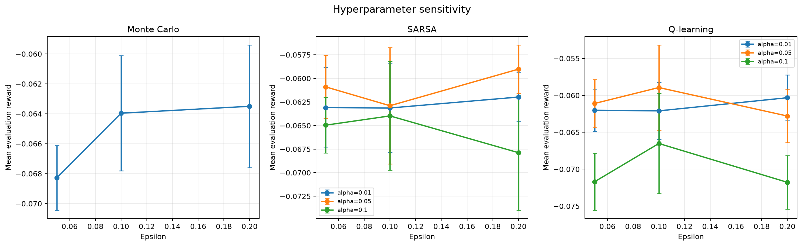
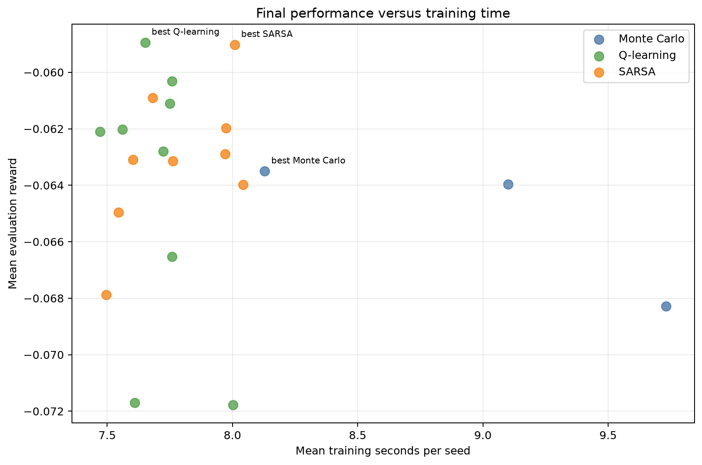

# Analysis: blackjack_pilot_grid

## Executive summary

The highest observed final reward came from **Q-learning** with `epsilon=0.1, alpha=0.05, gamma=1.0`. Its mean reward was **-0.05894** (approximate 95% CI -0.06471 to -0.05317), with a 42.66% win rate.

The sweep status is `completed`: 105 of 105 runs completed and 0 failed.

## Best configuration per algorithm

| Algorithm | Parameters | Mean reward (95% CI) | Win rate | Training time |
|---|---|---:|---:|---:|
| Monte Carlo | `epsilon=0.2, gamma=1.0` | -0.06350 [-0.06760, -0.05940] | 42.70% | 8.13 s |
| Q-learning | `epsilon=0.1, alpha=0.05, gamma=1.0` | -0.05894 [-0.06471, -0.05317] | 42.66% | 7.65 s |
| SARSA | `epsilon=0.2, alpha=0.05, gamma=1.0` | -0.05902 [-0.06159, -0.05645] | 42.80% | 8.01 s |

## Paired comparison of the selected configurations

Differences below are calculated seed by seed as the first algorithm minus the second. A positive value favors the first algorithm.

| Comparison | Seeds | Mean reward difference (95% CI) | Interpretation |
|---|---:|---:|---|
| Monte Carlo - Q-learning | 5 | -0.00456 [-0.01071, 0.00159] | difference is inconclusive at this precision |
| Monte Carlo - SARSA | 5 | -0.00448 [-0.00954, 0.00058] | difference is inconclusive at this precision |
| Q-learning - SARSA | 5 | 0.00008 [-0.00389, 0.00405] | difference is inconclusive at this precision |

These normal-approximation intervals are descriptive; they are not a replacement for a pre-specified final statistical testing protocol.

## Hyperparameter sensitivity

- **Monte Carlo:** the best setting was `epsilon=0.2, gamma=1.0` and the worst was `epsilon=0.05, gamma=1.0`. The observed reward spread was 0.00478.
- **Q-learning:** the best setting was `epsilon=0.1, alpha=0.05, gamma=1.0` and the worst was `epsilon=0.2, alpha=0.1, gamma=1.0`. The observed reward spread was 0.01284.
- **SARSA:** the best setting was `epsilon=0.2, alpha=0.05, gamma=1.0` and the worst was `epsilon=0.2, alpha=0.1, gamma=1.0`. The observed reward spread was 0.00886.

## Efficiency

Training times were collected while independent runs could execute in parallel. They are useful operational measurements, but CPU contention means they should not be treated as clean single-process algorithm benchmarks.

## Interpretation limits and next steps

- The default sweep uses only five training seeds. Repeat the selected settings with at least 10-20 fresh seeds for a stronger final comparison.
- The best settings were selected using the same evaluation results shown here. A separate final seed set reduces selection bias.
- Confidence-interval overlap alone does not prove algorithms are equivalent.
- This summary records only final performance. Add training checkpoints to compare learning speed and sample efficiency directly.
- Evaluate environment variants before making claims about generalisation.

## Generated artifacts

- Source summary: `results/sweeps/blackjack_pilot_grid_20260816T181220Z/summary.json`
- Full ranked table: `configuration_results.csv`
- Final reward chart: `configuration_performance.png`
- Sensitivity chart: `hyperparameter_sensitivity.png`
- Efficiency chart: `reward_vs_training_time.png`
