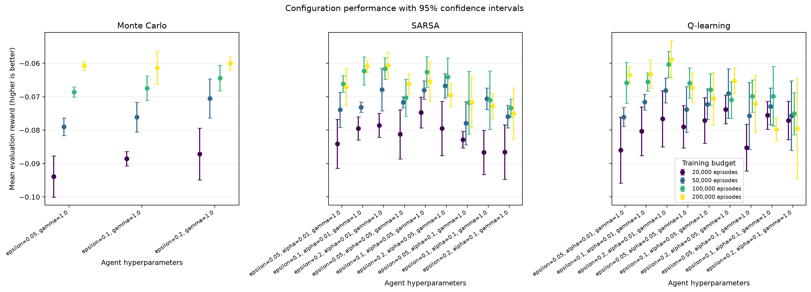
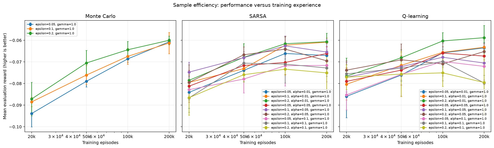
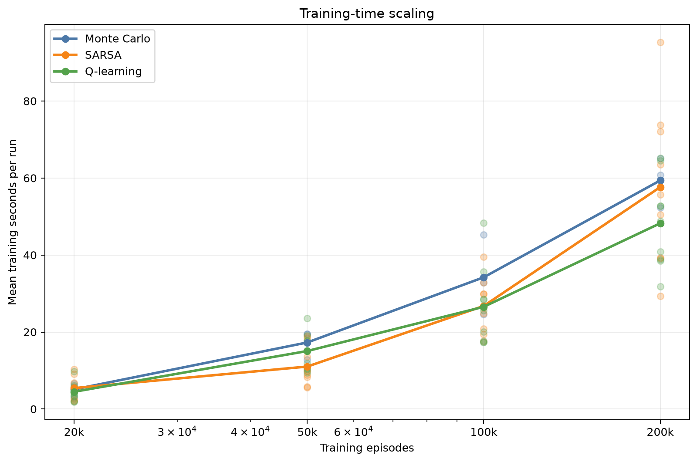

# Analysis: blackjack_pilot_grid

## Executive summary

The highest observed final reward came from **Q-learning** with `epsilon=0.2, alpha=0.01, gamma=1.0`. Its mean reward was **-0.05882** (approximate 95% CI -0.06448 to -0.05316), with a 42.65% win rate.

The sweep status is `completed`: 420 of 420 runs completed and 0 failed.

## Best configuration per algorithm

| Algorithm | Training episodes | Parameters | Mean reward (95% CI) | Win rate | Training time |
|---|---:|---|---:|---:|---:|
| Monte Carlo | 200,000 | `epsilon=0.2, gamma=1.0` | -0.06002 [-0.06193, -0.05811] | 42.76% | 60.80 s |
| Q-learning | 200,000 | `epsilon=0.2, alpha=0.01, gamma=1.0` | -0.05882 [-0.06448, -0.05316] | 42.65% | 64.54 s |
| SARSA | 200,000 | `epsilon=0.2, alpha=0.01, gamma=1.0` | -0.06068 [-0.06456, -0.05680] | 42.76% | 39.19 s |

## Paired comparison of the selected configurations

Differences below are calculated seed by seed as the first algorithm minus the second. A positive value favors the first algorithm.

| Comparison | Seeds | Mean reward difference (95% CI) | Interpretation |
|---|---:|---:|---|
| Monte Carlo - Q-learning | 5 | -0.00120 [-0.00853, 0.00613] | difference is inconclusive at this precision |
| Monte Carlo - SARSA | 5 | 0.00066 [-0.00359, 0.00491] | difference is inconclusive at this precision |
| Q-learning - SARSA | 5 | 0.00186 [-0.00444, 0.00816] | difference is inconclusive at this precision |

These normal-approximation intervals are descriptive; they are not a replacement for a pre-specified final statistical testing protocol.

## Sample efficiency

Each point is a separately trained agent at that episode budget. Higher reward with fewer episodes indicates better sample efficiency.

## Efficiency

Training times were collected while independent runs could execute in parallel. They are useful operational measurements, but CPU contention means they should not be treated as clean single-process algorithm benchmarks.

## Interpretation limits and next steps

- This experiment uses only 5 training seeds per configuration. Use at least 10-20 fresh seeds for a stronger final comparison.
- The best settings were selected using the same evaluation results shown here. A separate final seed set reduces selection bias.
- Confidence-interval overlap alone does not prove algorithms are equivalent.
- Episode-budget points are trained independently from scratch; they estimate sample efficiency but are not checkpoints from one continuous run.
- Evaluate environment variants before making claims about generalisation.

## Generated artifacts

- Source summary: `results/sweeps/blackjack_pilot_grid_20260817T102656Z/summary.json`
- Full ranked table: `configuration_results.csv`
- Final reward chart: `configuration_performance.png`
- Sample-efficiency chart: `sample_efficiency.png`
- Training-time chart: `training_time.png`
