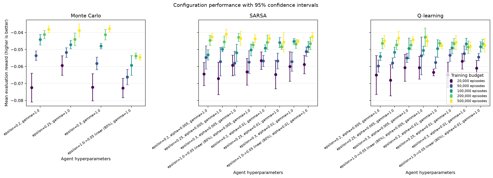
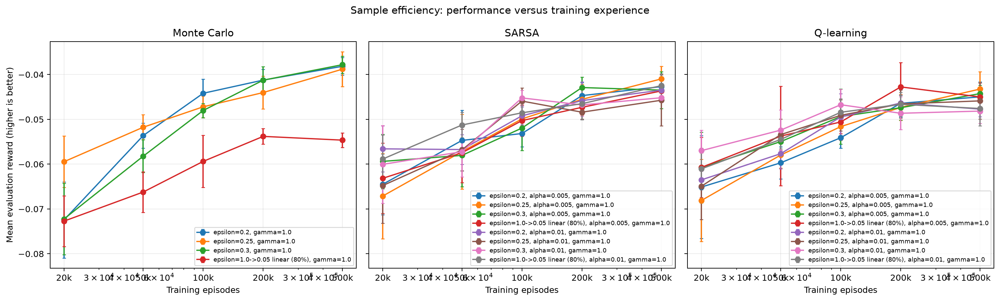
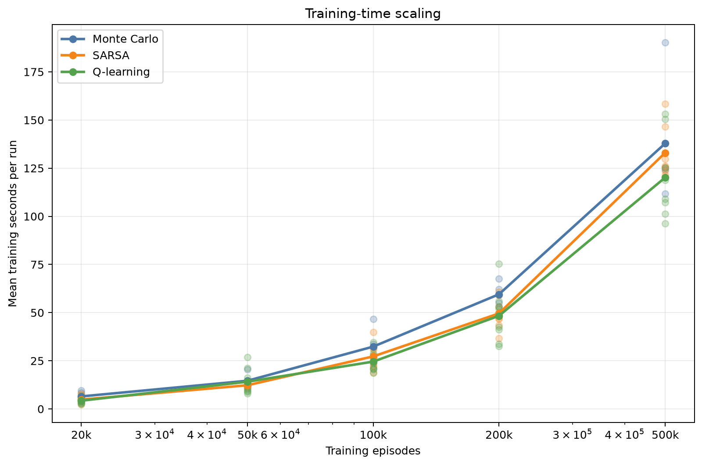

# Analysis: blackjack_refined_grid

## Executive summary

The highest observed final reward came from **Monte Carlo** with `epsilon=0.3, gamma=1.0`. Its mean reward was **-0.03780** (approximate 95% CI -0.03972 to -0.03588), with a 43.93% win rate.

The sweep status is `completed`: 500 of 500 runs completed and 0 failed.

## Best configuration per algorithm

| Algorithm | Training episodes | Parameters | Mean reward (95% CI) | Win rate | Training time |
|---|---:|---|---:|---:|---:|
| Monte Carlo | 500,000 | `epsilon=0.3, gamma=1.0` | -0.03780 [-0.03972, -0.03588] | 43.93% | 124.29 s |
| Q-learning | 200,000 | `epsilon=1.0->0.05 linear (80%), alpha=0.005, gamma=1.0` | -0.04276 [-0.04816, -0.03736] | 43.52% | 75.33 s |
| SARSA | 500,000 | `epsilon=0.25, alpha=0.005, gamma=1.0` | -0.04098 [-0.04379, -0.03817] | 43.72% | 158.28 s |

## Paired comparison of the selected configurations

Differences below are calculated seed by seed as the first algorithm minus the second. A positive value favors the first algorithm.

| Comparison | Seeds | Mean reward difference (95% CI) | Interpretation |
|---|---:|---:|---|
| Monte Carlo - Q-learning | 5 | 0.00496 [-0.00150, 0.01142] | difference is inconclusive at this precision |
| Monte Carlo - SARSA | 5 | 0.00318 [0.00005, 0.00631] | interval excludes zero |
| Q-learning - SARSA | 5 | -0.00178 [-0.00632, 0.00276] | difference is inconclusive at this precision |

These normal-approximation intervals are descriptive; they are not a replacement for a pre-specified final statistical testing protocol.

## Sample efficiency

Each point is a separately trained agent at that episode budget. Higher reward with fewer episodes indicates better sample efficiency.

## Efficiency

Training times were collected while independent runs could execute in parallel. They are useful operational measurements, but CPU contention means they should not be treated as clean single-process algorithm benchmarks.

## Interpretation limits and next steps

- This experiment uses only 5 training seeds per configuration. Use at least 10-20 fresh seeds for a stronger final comparison.
- The best settings were selected using the same evaluation results shown here. A separate final seed set reduces selection bias.
- Confidence-interval overlap alone does not prove algorithms are equivalent.
- Episode-budget points are trained independently from scratch; they estimate sample efficiency but are not checkpoints from one continuous run.
- Evaluate environment variants before making claims about generalisation.

## Generated artifacts

- Source summary: `results/sweeps/blackjack_refined_grid_20260817T111811Z/summary.json`
- Full ranked table: `configuration_results.csv`
- Final reward chart: `configuration_performance.png`
- Sample-efficiency chart: `sample_efficiency.png`
- Training-time chart: `training_time.png`
