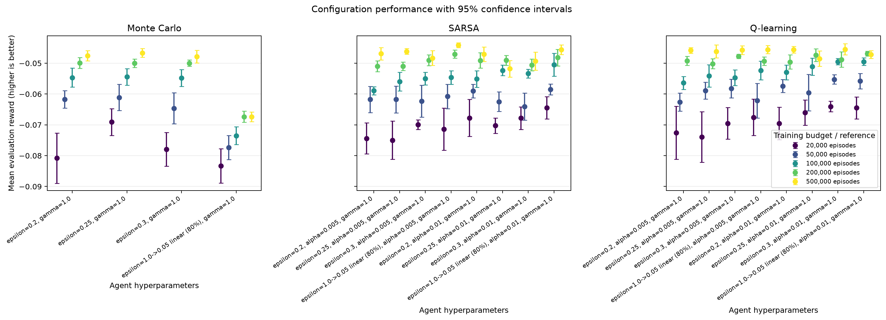
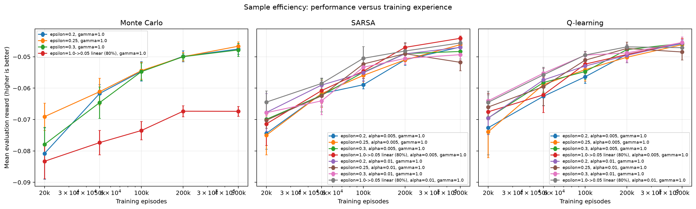
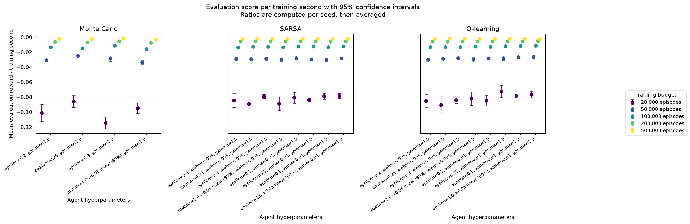
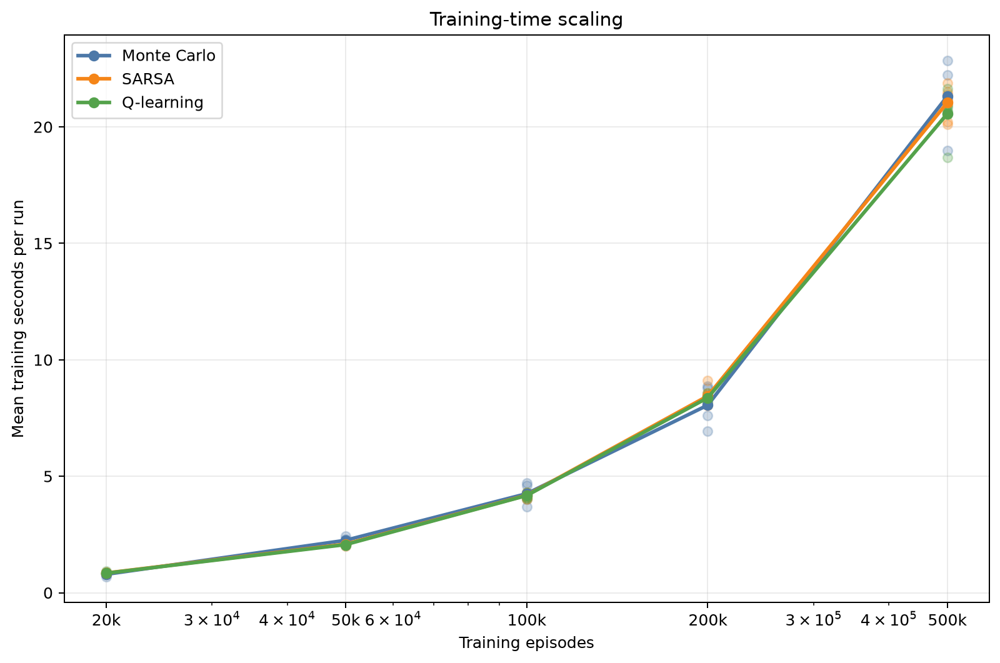

# Analysis: blackjack_refined_grid

## Executive summary

The highest observed final reward came from **SARSA** with `epsilon=1.0->0.05 linear (80%), alpha=0.005, gamma=1.0`. Its mean reward was **-0.04414** (approximate 95% CI -0.04489 to -0.04339), with a 43.30% win rate.

The sweep status is `completed`: 500 of 500 runs completed and 0 failed.

## Best configuration per algorithm

| Algorithm | Training episodes | Parameters | Mean reward (95% CI) | Win rate | Training time |
|---|---:|---|---:|---:|---:|
| Monte Carlo | 500,000 | `epsilon=0.25, gamma=1.0` | -0.04666 [-0.04806, -0.04526] | 43.39% | 18.97 s |
| Q-learning | 500,000 | `epsilon=0.3, alpha=0.01, gamma=1.0` | -0.04546 [-0.04722, -0.04370] | 43.19% | 20.57 s |
| SARSA | 500,000 | `epsilon=1.0->0.05 linear (80%), alpha=0.005, gamma=1.0` | -0.04414 [-0.04489, -0.04339] | 43.30% | 20.21 s |

## Paired comparison of the selected configurations

Differences below are calculated seed by seed as the first algorithm minus the second. A positive value favors the first algorithm.

| Comparison | Seeds | Mean reward difference (95% CI) | Interpretation |
|---|---:|---:|---|
| Monte Carlo - Q-learning | 5 | -0.00119 [-0.00356, 0.00117] | difference is inconclusive at this precision |
| Monte Carlo - SARSA | 5 | -0.00252 [-0.00435, -0.00068] | interval excludes zero |
| Q-learning - SARSA | 5 | -0.00132 [-0.00305, 0.00041] | difference is inconclusive at this precision |

These normal-approximation intervals are descriptive; they are not a replacement for a pre-specified final statistical testing protocol.

## Sample efficiency

Each point is a separately trained agent at that episode budget. Higher reward with fewer episodes indicates better sample efficiency.

## Efficiency

This chart uses the same hyperparameter axis as the configuration-performance plot. For each seed, the evaluation mean reward is divided by that run's training time; points and 95% intervals summarize those per-seed ratios.

Because Blackjack rewards are negative, this literal ratio is descriptive: a slower run can move the value closer to zero even without improving reward. Model selection therefore remains based only on mean evaluation reward.

Training times were collected while independent runs could execute in parallel. They are useful operational measurements, but CPU contention means they should not be treated as clean single-process algorithm benchmarks.

## Interpretation limits and next steps

- This experiment uses only 5 training seeds per configuration. Use at least 10-20 fresh seeds for a stronger final comparison.
- The best settings were selected using the same evaluation results shown here. A separate final seed set reduces selection bias.
- Confidence-interval overlap alone does not prove algorithms are equivalent.
- Episode-budget points are trained independently from scratch; they estimate sample efficiency but are not checkpoints from one continuous run.
- Evaluate environment variants before making claims about generalisation.

## Generated artifacts

- Source summary: `results/sweeps/blackjack_refined_grid_20260820T091421Z/summary.json`
- Full ranked table: `configuration_results.csv`
- Final reward chart: `configuration_performance.png`
- Sample-efficiency chart: `sample_efficiency.png`
- Training-time chart: `training_time.png`
- Performance-versus-training-time chart: `performance_vs_training_time.png`
